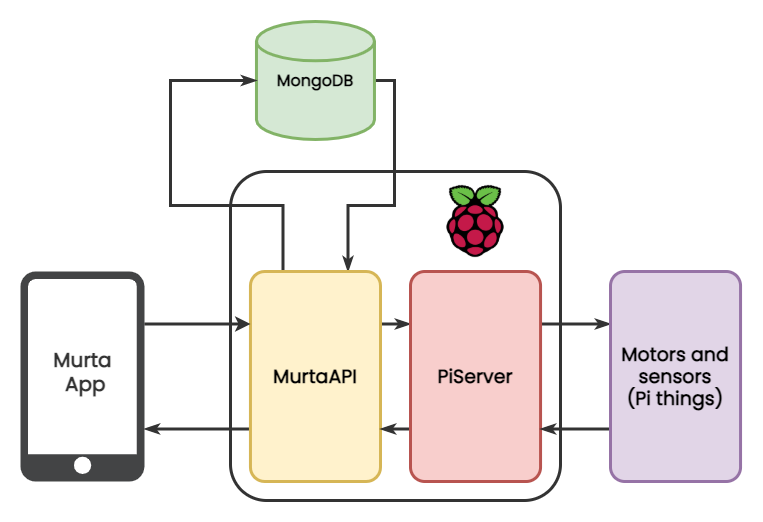

# **PiServer**
NodeJS server running on my Raspberry Pi. Will handle all connections between sensors and motors, and **Murta App** backend, [**MurtaAPI**](https://github.com/SuriSureda/MurtaAPI).

# Features
* Manage requests to motors and sensors.
* Wakes up MurtaAPI *actually hosted on Heroku* ( it's going to be moved to the RaspberryPi)

## Motors and sensors
Coming soon